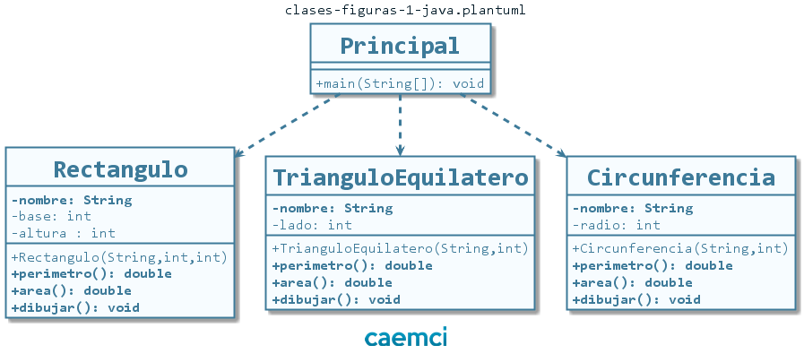
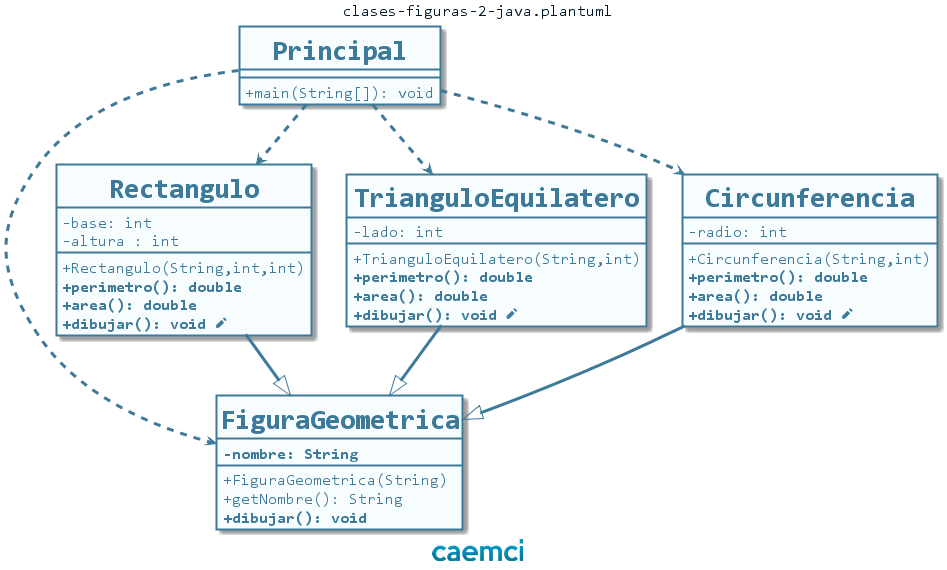
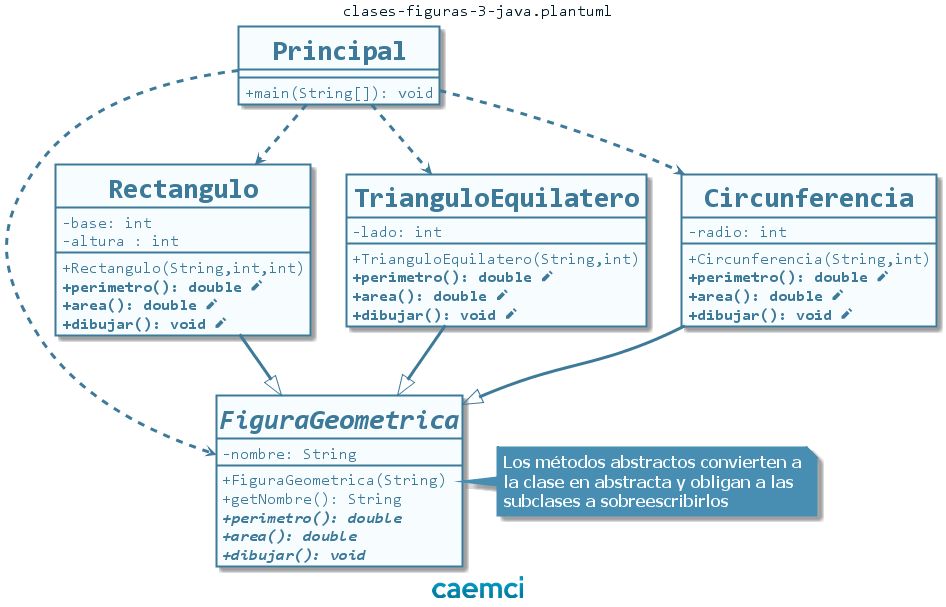
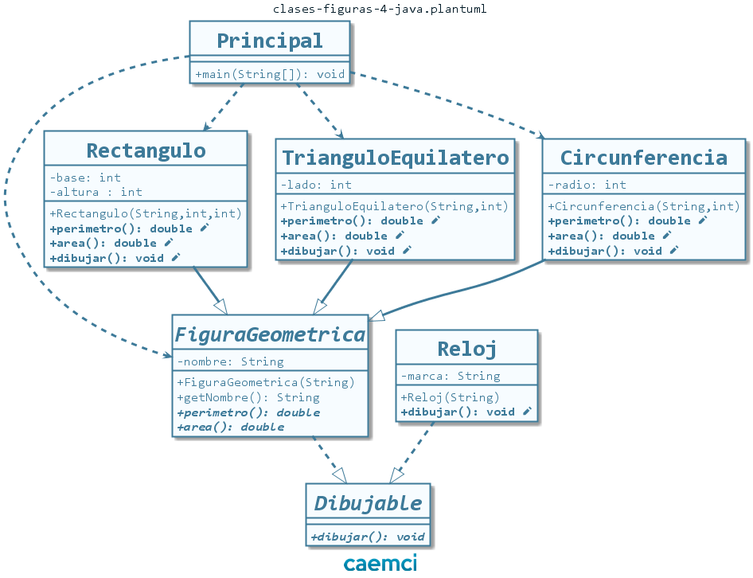

# Figuras Geométricas en Java

## Descripción

Explicación de los conceptos básicos del paradigma orientado a objetos, utilizando como ejemplo una jerarquía de figuras geométricas.

## Versiones

El repositorio se encuentra versionado en cuatro partes *(Ver pestaña [releases](https://github.com/caemci/figuras-java/releases))*.

### Versión 1: Encapsulamiento

Primera versión del proyecto, con las clases `TrianguloEquilatero`, `Circunferencia` y `Rectangulo` encapsuladas e independientes.

### Versión 2: Herencia

Introducción al concepto de herencia con la creación de la superclase `FiguraGeometrica`.

### Versión 3: Polimorfismo

Introducción al concepto de polimorfismo por herencia. La superclase `FiguraGeometrica` se vuelve abstracta y obliga a sus clases hijas a sobreescribir sus métodos abstractos. Luego cada figura responde al mismo mensaje de maneras diferentes.

### Versión 4: Interfaces

Introducción al concepto de polimorfismo por interfaces. La aparición de una clase `Reloj` que comparte ciertas características de las figuras geométricas pero no pertenece a su jerarquía, obliga a reformular el modelo con la aparición de la interface `Dibujable`.

Realizado con NetBeans 8.2. Compatible con Eclipse.